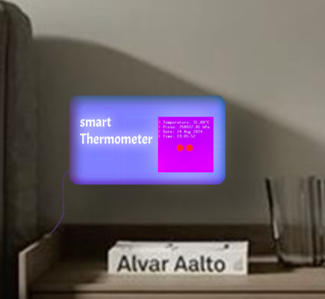

# Date and thermometer clock 
Display temperature, pressure, clock, and date on the LCD screen module.

:::info

**Author**: Alkhatib Hoda \
**GitHub Project Link**: https://github.com/UPB-FILS-MA/project-AlkhatibHoda

:::

## Description

This project features an advanced digital clock displaying the current date, time, temperature, and atmospheric pressure on the LCD screen module aiding in daily organization. 

## Motivation

To create a practical device that aids daily planning and making informed decisions based on environmental conditions with real-time information on time, date, temperature, and pressure, while also providing a valuable learning experience in electronics and programming.

## Architecture
Here is a clear architecture image:

According to the image here is an explanation about what each component does:

| The component | What is it  | Why do we need it |
| --- | --- | --- |
| `Raspberry Pi Pico W` | A microcontroller board with built-in Wi-Fi. |  The Pico W is the brain of your project. It controls all the other components and handles communication with the internet to get the current date and time.|
| `BMP280` | A device that measures the temperature and atmospheric pressure of its environment. |To monitor and display the temperature and pressure as part of your project. |
| `LCD screen` | A screen that shows information in a readable format. | To present the temperature, pressure, date, and time in a way that you can easily see and understand. It acts as the output interface of your project.|
| `Buzzer` | A small device that makes noise. |To provide audio feedback or alerts. For example, it could beep when the temperature or pressure reaches a certain threshold, or simply to signal that the system is active.|
| [`API Through Wifi`]((http://worldtimeapi.org/api/timezone/Europe/Bucharest)) |A web service that provides date and time information. |To get the current time and date from the internet.This way your project has accurate and up-to-date time information without needing a separate real-time clock module and can ensure your time information is always accurate.|

## Log

<!-- write every week your progress here -->

### Week 6 - 12 May
I bought the components .

### Week 7 - 19 May
Tested codes for my project.

### Week 20 - 26 May
Worked on the documentation and posted my project.

## Hardware
When connected :

A closer look to the connection:
 

 I tried to make a 3D model here :) :
.

### Schematics:

The schematic image shows a clearer connection for the components , using the online simulator [*Wokwie*](https://wokwi.com/).\
note: the lcd screen is connected by default to the pico explorer base .\
the buzzer is connected (with a resistance) to GPIO 1.\
here is the BMP280 connection table
| PIN | connection with pico explorer ~ pico PIN|
| --- | --- |
| `VCC` | power source (3V3)|
| `GND` | ground |
| `SCL` | 	`12SCL` line ~ GP21 |
| `SDA` | `12SDA` line ~ GP20 |
| `CSB` | not used  |
| `SDO` | not used  |

note:On the Pico Explorer base, the I2C pins are marked for simple use.

### Bill of Materials

<!-- Fill out this table with all the hardware components that you might need.
The format is
| [Device](link://to/device) | This is used ... | [price](link://to/store) |
-->

| Device                                                                                                  | Usage               | Price                                                                                                                                                                                                                                                                                |
| ------------------------------------------------------------------------------------------------------- | ------------------- | ------------------------------------------------------------------------------------------------------------------------------------------------------------------------------------------------------------------------------------------------------------------------------------ |
| [Raspberry Pi Pico WH, Wireless+Headers](https://www.raspberrypi.com/documentation/microcontrollers/raspberry-pi-pico.html) | The microcontroller | [56 RON](https://ardushop.ro/ro/home/2819-raspberry-pi-pico-wh.html?search_query=pico&results=14) |
| [Pico Explorer Base](https://shop.pimoroni.com/products/pico-explorer-base?variant=32369514315859)                                                                   |functional Base for components | [160 RON](https://www.optimusdigital.ro/en/others/12148-pico-explorer-base.html) |
| [Passive Buzzer](https://projects.raspberrypi.org/en/projects/introduction-to-the-pico/9)                                                                                      | Buzzer              | [4 RON ](https://ardushop.ro/ro/electronica/194-buzzer.html?search_query=buzzer&results=16) |
| [BMP280](https://www.bosch-sensortec.com/media/boschsensortec/downloads/datasheets/bst-bmp280-ds001.pdf)                                                                                       | Digital pressure and temperature sensor     | [17 RON ](https://www.emag.ro/modul-senzor-de-presiune-atmosferica-bmp280-cl214/pd/DGKX6JBBM/) |
| [65 x Fire Jumper](https://www.digikey.com/en/htmldatasheets/production/5367683/0/0/1/20ul1015strbla250)                                                                                    | connection           | [12  RON](https://ardushop.ro/ro/electronica/28-65-x-jumper-wires.html?search_query=fir&results=286) |
| [40 x Dupont Yarn Mother-Father 10cm](https://www.digikey.com/en/htmldatasheets/production/5367683/0/0/1/20ul1015strbla250)                                                                 | connection           | [5 RON](https://ardushop.ro/ro/electronica/23-40-x-dupont-cables-female-male-10cm.html?search_query=fir&results=286) |
          

## Software

| Library                                  | Description                        | Usage                              |
| ---------------------------------------- | ---------------------------------- | ---------------------------------- |
| [Embassy](https://embassy.dev/)          | Framework                          | Framework                          |
| [Embedded-graphics](https://github.com/embedded-graphics/embedded-graphics)          | for drawing 2D graphics                          | for rendering graphics on displays |
| [embassy-rp](https://github.com/embassy-rs/embassy/tree/main/embassy-rp)          | HAL for Raspberry Pi RP2040, supporting both blocking and async APIs for various peripherals.                       | Simplifies peripheral control on RP2040 with async support. |
| [embassy-executor](https://github.com/embassy-rs/embassy/tree/main/embassy-executor)       | An async executor for embedded systems, part of the Embassy ecosystem.               | Manages asynchronous tasks in embedded applications.               |
| [embedded-hal](https://github.com/rust-embedded/embedded-hal)       | Programming Language               | Programming Language               |
| [cyw43_pio](https://github.com/rp-rs/rp-hal/tree/main/boards/pico/cyw43_pio)          |A library to control the Cypress CYW43 Wi-Fi chip using the Raspberry Pi Pico PIO.                        | Manages Wi-Fi connectivity for Raspberry Pi Pico.                      |
| [embassy-sync](https://github.com/embassy-rs/embassy/tree/main/embassy-sync)          |Provides synchronization primitives like mutexes and channels for async code in embedded environments.                        |Enables safe concurrency in embedded applications.                     |
| [st7789](https://github.com/almindor/st7789)          |A Rust driver for controlling ST7789 displays, compatible with embedded-hal.                      | 	Enables control and rendering on ST7789-based displays.                          |
## Links

<!-- Add a few links that inspired you and that you think you will use for your project -->

1. [Inspiration project](https://www.youtube.com/watch?v=gBofy7MMdIY)
2. [YT video](https://www.youtube.com/watch?v=1INA9AmaDtQ&t=650s)
